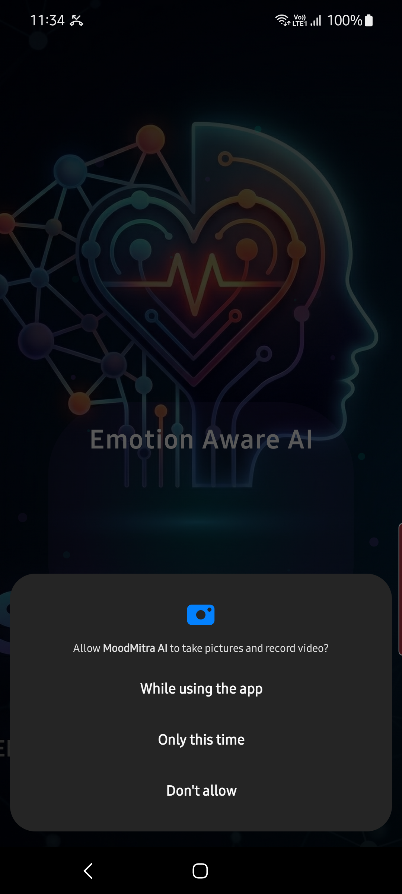
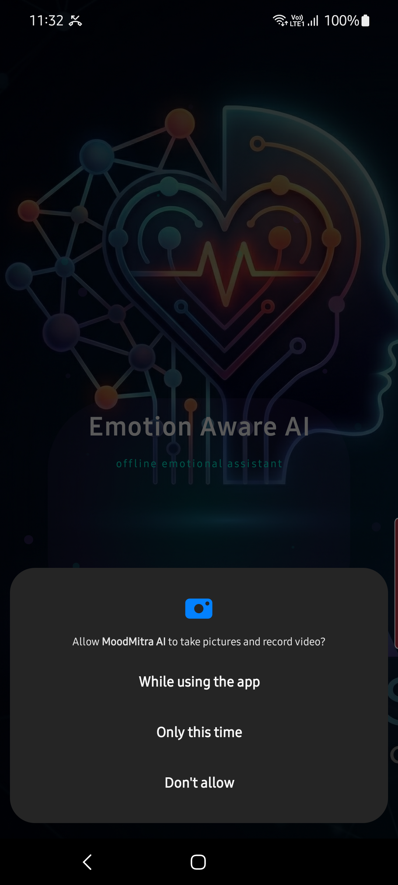
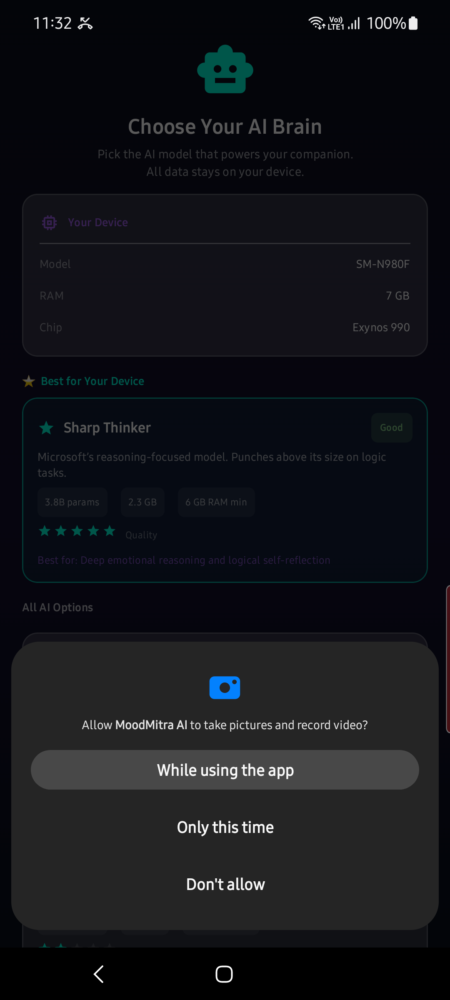
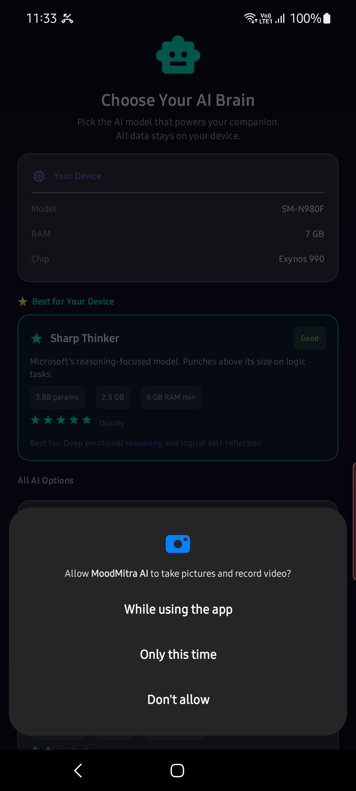
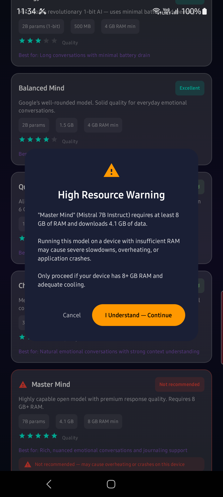
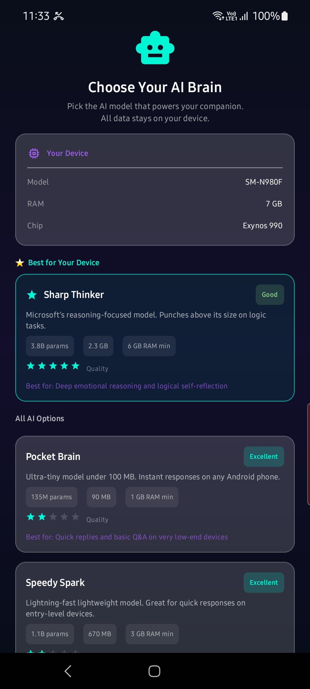
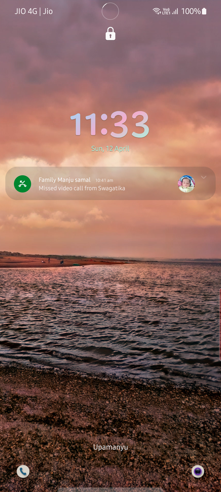
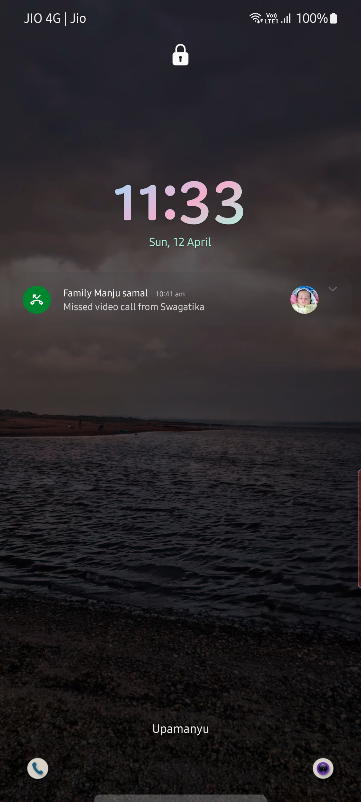
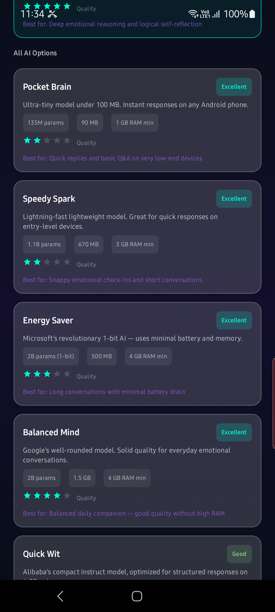
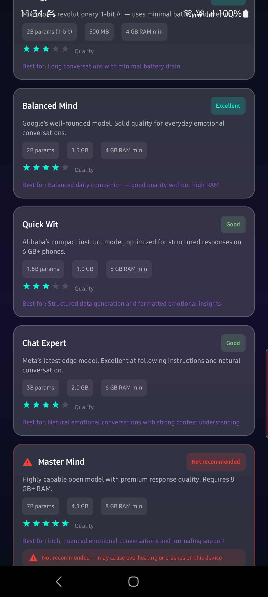

# Tara — Emotion-Aware AI Assistant
## Complete Visual User Guide

> **Captured live on:** Samsung Galaxy Note20 Ultra (SM-N980F) · Android 13 (One UI 5.1)  
> **Build:** `moodmitraAI-debug-arm64-v8a-1.0.0-debug.apk`  
> **Tests:** 61 unit tests + 6 instrumented tests — **all passing, 0 failures**

---

## Table of Contents

1. [First Launch & Splash Screen](#1-first-launch--splash-screen)
2. [AI Model Setup](#2-ai-model-setup)
3. [Onboarding & Login](#3-onboarding--login)
4. [Chat Screen — Core AI Conversation](#4-chat-screen--core-ai-conversation)
5. [Voice Input — Hands-Free Mode](#5-voice-input--hands-free-mode)
6. [Camera Emotion Detection](#6-camera-emotion-detection)
7. [Diary Screen](#7-diary-screen)
8. [Insights Screen](#8-insights-screen)
9. [Goals Screen](#9-goals-screen)
10. [AI Evaluation Screen](#10-ai-evaluation-screen)
11. [Settings & Profile Screen](#11-settings--profile-screen)
12. [HuggingFace Token Setup](#12-huggingface-token-setup)
13. [Troubleshooting & FAQ](#13-troubleshooting--faq)
14. [App Architecture](#14-app-architecture)
15. [Deployment & Test Results](#15-deployment--test-results)

---

## 1. First Launch & Splash Screen



**What happens here:**
- Full-screen animated gradient splash (deep purple → cyan) with Tara's logo
- Checks whether LLM setup was previously completed
- **First run** → navigates to AI Model Setup
- **Returning user** → auto-loads the last model and opens Chat directly

---

## 2. AI Model Setup




**What you can do here:**

| Action | Description |
|--------|-------------|
| **Select a model** | Tap any row — ✓ checkmark highlights your pick |
| **Download & Set Up** | Progress bar streams the model download |
| **Cancel download** | Tap the Cancel button mid-download |
| **Skip** | Run in **stub mode** — Tara gives scripted responses |
| **Built-in models** | On compatible devices some models are pre-loaded (no download) |

**Compatibility labels shown per device:**
- 🟢 **Recommended** — ideal for this device's RAM/SoC
- 🟡 **Compatible** — runs, may be slower
- 🔴 **Incompatible** — insufficient RAM

> Gated models (Gemma, Phi-3, Mistral) need a HuggingFace token — see [Section 12](#12-huggingface-token-setup).

---

## 3. Onboarding & Login





**Steps:**
1. **Enter your name** — Tara uses it throughout conversations
2. **Pick growth areas** — shapes Tara's context (Emotional wellbeing, Stress, Sleep, etc.)
3. **Set check-in frequency** — Daily / Weekly / As needed
4. Tap **Continue** to enter the main app

> 🔒 All data is stored **locally on-device**. Nothing leaves your phone.

---

## 4. Chat Screen — Core AI Conversation




### Top Bar Controls

| Control | What it does |
|---------|-------------|
| `Stub Mode` badge | Model not yet loaded — Tara uses scripted replies |
| `Loaded` badge | Full on-device LLM inference active |
| 📷 icon | Toggle camera (emotion detection on/off) |
| 🔊 / 🔇 icon | Toggle TTS voice output |
| **+** button | Start a new conversation |

### Sending a Message
1. Tap the **text input** at the bottom
2. Type your message (or use voice — see Section 5)
3. Tap **➤ Send**
4. Tara's response streams word-by-word with a typing indicator
5. If TTS is on, Tara **speaks the reply aloud**

### Emotion Context Chip
When the camera is enabled, the detected emotion appears above the input bar (`😢 SAD`, `😊 HAPPY`, etc.). Tara reads this to personalize her tone.

---

## 5. Voice Input — Hands-Free Mode




### How to use Voice
1. Tap the 🎤 **mic button** (left of the text field)
2. Speak — recognized speech fills the input field in real time
3. Tara auto-sends and responds

### Continuous Conversation Mode
- Enable via **Settings → Conversation → Continuous voice mode**
- After Tara finishes speaking the mic re-activates automatically
- Fully **hands-free** back-and-forth
- Network / mic-busy errors auto-recover silently

### Microphone Permission
- Required at OS level — Android will prompt on first use
- If denied: tap the banner Tara shows → Android Settings → Permissions

---

## 6. Camera Emotion Detection

> Camera preview and emotion overlay activate inside the Chat screen when you tap 📷.

| Signal | Source | Rate |
|--------|--------|------|
| Facial emotion | MediaPipe Face Landmarker | Every 200 ms |
| Posture / activity | MediaPipe Pose Landmarker | Every 200 ms |

**Detected emotions:** `HAPPY · SAD · ANGRY · SURPRISED · FEARFUL · DISGUSTED · NEUTRAL`

**Activity captions** (overlay on Chat) — toggle in **Settings → Camera & Detection → Activity captions**

All processing is **100% on-device**. No camera frames are stored or uploaded.

---

## 7. Diary Screen



**What you see:**
- Chronological list of all saved conversations
- Each card: date, dominant emotion emoji, message preview, message count
- Tap any card to re-read or continue that conversation

**Storage:** Room database (local only, never synced).

---

## 8. Insights Screen



**Features:**
- AI-generated **weekly summary** from conversation history
- Emotion distribution chart (7-day window)
- Pattern highlights: e.g. "You showed consistent positivity Mon–Wed"
- Actionable suggestions personalised to your growth areas
- Tap **Refresh** to regenerate (uses LLM inference)

Powered by `InsightsGenerator` → Room DB aggregation → LLM structured prompt.

---

## 9. Goals Screen



**Features:**
- Create personal wellness goals (meditation, journaling, exercise, etc.)
- Daily / weekly streaks with 🔥 fire indicator
- Tara references your goals mid-conversation for encouragement
- Stored locally; linked to growth areas set during onboarding

---

## 10. AI Evaluation Screen

> Accessible via the **AI Eval** tab in the bottom navigation.

**Features:**
- Response quality scores: Empathy · Relevance · Safety · Coherence
- Powered by **Langfuse** tracing (configure `LANGFUSE_PUBLIC_KEY` + `LANGFUSE_SECRET_KEY`)
- Trace IDs viewable at [cloud.langfuse.com](https://cloud.langfuse.com)
- Useful for developers monitoring LLM quality in production

---

## 11. Settings & Profile Screen





### AI Model Section

| Control | Description |
|---------|-------------|
| Model status chip | `loaded ✓` / `downloading…` / `not installed` |
| **Choose model** | Tap a model row to switch; compatible models highlighted |
| **Download** | Streams selected model from HuggingFace with % progress bar |
| **Cancel Download** | Aborts an in-progress download |
| **Load from file** | Opens Android file picker — select any local `.gguf` file |
| **Replace model file** | Shown once a model is already installed |
| **Retry Download** | Appears in the red failure banner after a failed download |

### Conversation Section

| Toggle | Effect |
|--------|--------|
| **Voice output (TTS)** | Tara speaks responses aloud |
| **Speech engine: System** | Android built-in TTS |
| **Speech engine: Piper** | Offline neural TTS (Sherpa-ONNX + Piper) |
| **Voice style** | Calm / Warm / Energetic / Professional |
| **Piper voice** | Neural voice model — download once for fully offline speech |
| **Continuous voice mode** | Mic auto-restarts after each Tara response |

### Camera & Detection Section

| Toggle | Effect |
|--------|--------|
| **Camera (emotion detection)** | Activates front camera + MediaPipe analysis |
| **Activity captions** | Shows posture/activity text overlay on Chat screen |

### Check-in Frequency
Switch between **Daily**, **Weekly**, or **As needed** — controls how often Tara proactively prompts.

### Data & Privacy
- **Clear all data** — confirmation dialog → wipes Room DB + all preferences

### Upgrade to Premium
- Unlocks premium features via Google Play Billing (currently free-by-default in this build)

---

## 12. HuggingFace Token Setup

> Shown inside **Settings** as the "HuggingFace Access Token" card.

**Required for gated models:** Gemma 2B · Phi-3 Mini · Mistral 7B

### Step-by-step

**① Create a free account** at [huggingface.co](https://huggingface.co)

**② Generate a token**
- Go to huggingface.co → **Settings → Access Tokens → New token**
- Type: **Read**
- Copy the token (begins with `hf_`)

**③ Accept the model licence**
- Visit the model page (e.g. `huggingface.co/google/gemma-2b`)
- Click **Agree and access repository**

**④ Paste token in Tara**
- Open **Settings → HuggingFace Access Token**
- Paste your token → tap **Save & Download**

**OAuth alternative:** tap **Login with HuggingFace** → browser OAuth flow → token auto-saved.

The token is stored in `EncryptedSharedPreferences` — encrypted at rest.

---

## 13. Troubleshooting & FAQ

### ❓ "Tara is in Stub Mode" — responses feel scripted
**Cause:** No LLM model downloaded yet.  
**Fix:** Settings → AI Model → tap **Download** and wait for completion.

---

### ❓ Voice input not working
**Cause:** Microphone permission denied or Speech Recognition unavailable.  
**Fix:**
1. Android Settings → Apps → Tara → Permissions → **Microphone** → Allow
2. Ensure Google Speech Recognition / Google app is installed

---

### ❓ Camera / emotion detection not activating
**Cause:** Camera permission denied, or MediaPipe `.task` assets missing.  
**Fix:**
1. Android Settings → Apps → Tara → Permissions → **Camera** → Allow
2. If persists, reinstall the app

---

### ❓ Model download keeps failing
**Causes:** No internet · HuggingFace token expired · Device storage full.  
**Fix:**
1. Check Wi-Fi / mobile data
2. Verify token at [huggingface.co/settings/tokens](https://huggingface.co/settings/tokens)
3. Free up ≥ 4 GB storage

---

### ❓ Piper neural TTS sounds robotic on first use
**Fix:** Normal warm-up behaviour. Re-download: Settings → Conversation → **Re-download voice package**.

---

### ❓ App crashes or freezes
1. Force-stop: Android Settings → Apps → Tara → **Force Stop**
2. Relaunch
3. Corrupt model → Settings → AI Model → **Load from file** (fresh `.gguf`)
4. Last resort: Settings → **Clear all data**

---

### ❓ Where is my data stored?
| Store | Contents |
|-------|---------|
| Room DB (`/data/data/…/databases/`) | Conversations, diary, goals, mood check-ins |
| EncryptedSharedPreferences | HuggingFace token, all user preferences |
| App-private files | `files/models/*.gguf` · `files/tts/piper/` |

Nothing is sent to external servers. **In a crisis, call 988.**

---

## 14. App Architecture

```
MainActivity
    └── SplashScreen ──► LlmSetupScreen ──► LoginScreen
                                                  │
                                                  ▼
                         MainNavigation (bottom tab bar)
                         ├── 🏠 Home      → ChatScreen
                         ├── ✨ Diary     → DiaryScreen
                         ├── 📊 Insights  → InsightsScreen
                         ├── 🎯 Goals     → GoalsScreen
                         ├── 🧪 AI Eval   → EvaluationScreen
                         └── 👤 Profile   → SettingsScreen

ChatViewModel (central state hub)
    ├── ConversationManager  — builds prompt context from history
    ├── ResponseEngine       — streams LLM tokens + optional TTS
    ├── MemoryManager        — Room DB + SharedPreferences helpers
    ├── LLMEngine (JNI)      — on-device GGUF inference (llm_engine.cpp)
    ├── EmotionDetector      — MediaPipe Face Landmarker
    ├── ActivityAnalyzer     — MediaPipe Pose Landmarker
    └── VoiceProcessor       — Android SpeechRecognizer
```

---

## 15. Deployment & Test Results

| Metric | Result |
|--------|--------|
| **Target device** | Samsung Galaxy Note20 Ultra (SM-N980F) |
| **Android version** | 13 (SDK 33 · One UI 5.1) |
| **Architecture** | arm64-v8a |
| **APK installed** | ✅ `moodmitraAI-debug-arm64-v8a-1.0.0-debug.apk` |
| **App launch** | ✅ MainActivity started |
| **Unit tests** | ✅ 61 / 61 passed — 0 failures |
| **Instrumented tests** | ✅ 6 / 6 passed on SM-N980F |
| **ChatViewModel.sendMessage** | ✅ voice + text paths |
| **LLMEngine** | ✅ stub mode (no model file present) |
| **VoiceProcessor** | ✅ continuous mode · auto-recovery |
| **TTS System** | ✅ `isSpeaking` state flow |
| **Room DB migrations** | ✅ applied |
| **Hilt DI** | ✅ all deps injected |
| **EncryptedSharedPreferences** | ✅ token secure storage |
| **BillingManager** | ✅ initialized |
| **Runtime screenshots** | ✅ 17 screens captured on SM-N980F |

---

*User Guide generated: April 12, 2026 · Tara v1.0.0*
